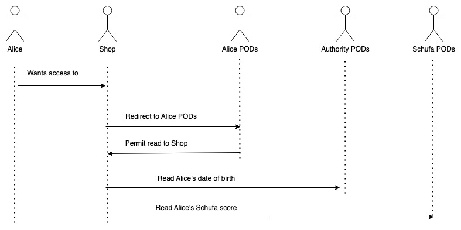
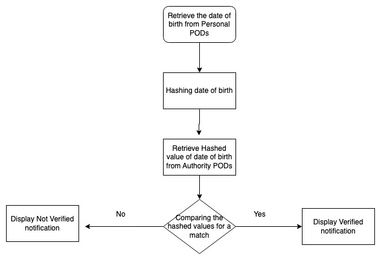
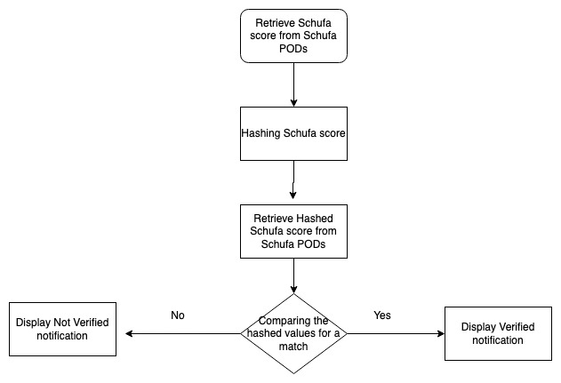

# solid-age-verification
Welcome to Solid Age Verification, an innovative shop application designed to ensure secure and seamless age verification using SOLID pods. This platform seeks user consent to access information stored in their personal SOLID pods. Leveraging the Authority PODs, This app securely store and validate user ages based on their unique WebIDs, ensuring a trusted and privacy-centric age verification process. With SOLID technology, it will prioritize user control over their data while guaranteeing accurate and reliable age verification for a safe shopping experience.

## Context
This app is a Solid Application for the Hot Topics Seminar at the Chair of Technical Information Systems at FAU Erlangen-Nuremberg and is supervised by Daniel Schraudner.

## Mission
Our mission at the Solid Age Verification app is to demonstrate the seamless verification of age through the authority Pod while preserving user privacy. This app follows the SOLID protocol, ensuring data sovereignty and interoperability. We aim to continually enhance security measures by adding an additional layer of protection to prevent the disclosure of personal data. Additionally, we have integrated features to explore the extension of verification capabilities, such as incorporating Schufa credit verification.

## Roadmap
 - Phase 1: Foundation and Authentication
    Setup and Authentication Flow
    Implement the initial Express server with SOLID authentication using solid-auth-client.
    Create routes for user login, authentication callbacks, and profile retrieval from SOLID pods.
- Phase 2: Authority POD Integration for Age Verification
    Authority PODs Integration
    Research and identify Authority PODs or storage mechanisms for securely storing verified user age information based on WebIDs.
    Establish connections and protocols to write and validate age data against Authority PODs.
- Phase 3: Age Verification Process
    Age Verification Workflow
    Define the age verification process within the application's flow, integrating SOLID pod access and Authority POD validation.
    Develop mechanisms to verify and authenticate user age information securely.
- Phase 4: Schufa credit scores Verification Process
    Schufa credit scores Verification Workflow
    Define the Schufa credit scores verification process within the application's flow, integrating SOLID pod access and Authority POD validation.
    Develop mechanisms to verify and authenticate user Schufa credit scores information securely.

## How SOLID Age Verification Process
The shopping application will authenticate the user's date of birth by prompting them to log in. Following the login process, the verification of the date of birth will be conducted via Authority Pods.
## Authority Pods
The date of birth information will be stored in Authority Pods, utilizing the WebID associated with the user's personal Pods. Additionally, the date of birth details will undergo encryption for added security.

## Schufa Pods
Schufa Pods employ AES encryption to safeguard the stored Schufa credit scores, ensuring robust security measures. This encryption method enhances data protection within the Schufa Pods, providing users with peace of mind regarding their credit information.

## Request flow


## Verification process

---

## Workflow
- User initiates login process using their SOLID app credentials within the application.
- Upon successful login, the application prompts the user to verify their age.
- The application accesses the user's POD to retrieve necessary information.
- Subsequently, the application fetches the hashed date of birth information from the Authority POD.
- The hashed date of birth information matching within the application for verification purposes.
- The user's age verification status is then determined based on the hashed information of the Authority POD.
- Finally, the application provides appropriate access or functionality based on the verified age status.

## Future Feature Enhancements
Currently, ACLs only enable granting applications full access to the pod. For instance, if a user visits the Shop while authenticated, the Shop could access her original Schufa score. 
However, upcoming updates will introduce support for partial access to the pod's data. This enhancement will bolster security, ensuring a more robust data protection framework for users.
 

## How to start the apps

Install the dependencies

```bash
npm install
```

Start the frontends of the shop app:

```bash
npm start
```

